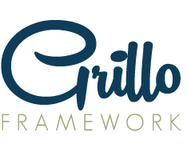

# Grillo Framework - A front-end framework for developing web applications.

Grillo is a front-end framework for developing web applications with a defined structure for organizing the various components that make up the project.

By calling it a front-end framework, it is not only just a framework containing HTML, CSS and JS files, but also one with a predefined set of tasks that are run by the [Grunt build system](http://gruntjs.com/). Grillo combines parts of frameworks, patterns and best practices to form a complete structure for creating web applications.

##Why Grillo?
...

##Setting up the development environment
...

##Tests
...

##Troubleshooting and Useful tools
...

##Contributors
...
1. Fork it!
2. Create your feature branch: `git checkout -b my-new-feature`
3. Commit your changes: `git commit -am 'Add some feature'`
4. Push to the branch: `git push origin my-new-feature`
5. Submit a pull request :D

##License
See [LICENSE](LICENSE) file.
